# GitHub Native 專案管理工具規格書

## 1. 架構與選型

- 前端：`Vite + TypeScript + 原生 CSS`
- 靜態儀表板部署：`GitHub Pages`
- 可寫入 API：`Vercel Functions`
- 任務主體：`GitHub Issues`
- 排程真相來源：`GitHub Projects v2`
- 自動化：`GitHub Actions`
- GitHub 整合：`GitHub GraphQL API + REST API`
- 測試：`Vitest`
- 時區：`Asia/Taipei`

選型理由：
- 儀表板以靜態站提供低成本讀取能力，適合管理層與成員查看。
- 甘特圖需要回寫 GitHub Projects 欄位，因此額外提供極薄 API 處理安全寫入。
- Issue 負責任務內容，Project v2 自訂欄位負責排程與狀態，責任清楚。
- GitHub Actions 用於資料彙整與 Pages 部署，維持 GitHub-native 工作流。
- Project 欄位同步採 GitHub GraphQL，Issue labels / assignees 採 GitHub REST，同步責任分離。
- GitHub Pages 採官方 `configure-pages`、`upload-pages-artifact`、`deploy-pages` workflow。

## 2. 資料模型

### 2.1 WorkItem

| 欄位 | 型別 | 必填 | 說明 |
| --- | --- | --- | --- |
| id | string | 是 | 儀表板內部唯一識別碼 |
| issueNumber | number | 是 | GitHub Issue 編號 |
| issueUrl | string | 是 | GitHub Issue 網址 |
| title | string | 是 | 任務標題 |
| status | string | 是 | 例如 `todo`、`in-progress`、`in-review`、`done` |
| priority | string | 否 | 優先級 |
| milestone | string \| null | 是 | 所屬 Milestone 名稱 |
| assignees | Assignee[] | 是 | 負責人清單 |
| projectItemId | string | 是 | Project v2 item id |
| projectId | string | 是 | Project v2 id |
| startDate | string \| null | 是 | `YYYY-MM-DD` |
| targetDate | string \| null | 是 | `YYYY-MM-DD` |
| durationDays | number | 是 | 由 start/target 衍生 |
| progressState | string | 是 | `on-track`、`at-risk`、`blocked`、`done` |
| blockedReason | string | 否 | 阻塞原因 |
| linkedPrs | PullRequestLink[] | 是 | 關聯 PR |
| labels | string[] | 是 | Issue labels |
| updatedAt | string | 是 | 最後更新時間 |

### 2.2 Assignee

| 欄位 | 型別 | 必填 | 說明 |
| --- | --- | --- | --- |
| login | string | 是 | GitHub 帳號 |
| name | string | 否 | 顯示名稱 |
| avatarUrl | string | 否 | 頭像網址 |

### 2.3 PullRequestLink

| 欄位 | 型別 | 必填 | 說明 |
| --- | --- | --- | --- |
| number | number | 是 | PR 編號 |
| title | string | 是 | PR 標題 |
| url | string | 是 | PR 網址 |
| state | string | 是 | `open`、`closed`、`merged` |

### 2.4 ProjectSummary

| 欄位 | 型別 | 必填 | 說明 |
| --- | --- | --- | --- |
| totalItems | number | 是 | 任務總數 |
| doneItems | number | 是 | 已完成數量 |
| inProgressItems | number | 是 | 進行中數量 |
| blockedItems | number | 是 | 阻塞數量 |
| overdueItems | number | 是 | 已逾期數量 |
| completionRate | number | 是 | 完成率 |

### 2.5 MemberLoad

| 欄位 | 型別 | 必填 | 說明 |
| --- | --- | --- | --- |
| login | string | 是 | GitHub 帳號 |
| name | string | 否 | 顯示名稱 |
| todoCount | number | 是 | 待辦數量 |
| inProgressCount | number | 是 | 進行中數量 |
| inReviewCount | number | 是 | 審查中數量 |
| blockedCount | number | 是 | 阻塞數量 |

### 2.6 ProjectSnapshot

| 欄位 | 型別 | 必填 | 說明 |
| --- | --- | --- | --- |
| generatedAt | string | 是 | 產出時間 |
| repository | string | 是 | `owner/repo` |
| projectId | string | 是 | GitHub Projects v2 id |
| milestones | string[] | 是 | 所有 milestone |
| members | MemberLoad[] | 是 | 成員負載資料 |
| workItems | WorkItem[] | 是 | 任務資料 |
| summary | ProjectSummary | 是 | 儀表板摘要 |

### 2.7 GanttMutationPayload

| 欄位 | 型別 | 必填 | 說明 |
| --- | --- | --- | --- |
| projectItemId | string | 是 | 要修改的 Project item id |
| startDate | string | 否 | 新開始日 |
| targetDate | string | 否 | 新截止日 |
| status | string | 否 | 新狀態 |
| assigneeLogins | string[] | 否 | 新負責人清單 |

## 3. 關鍵流程

### 3.1 Issue 建立與自動加入 Project

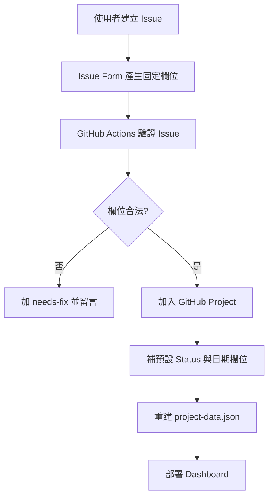

### 3.2 甘特圖拖拉更新時程

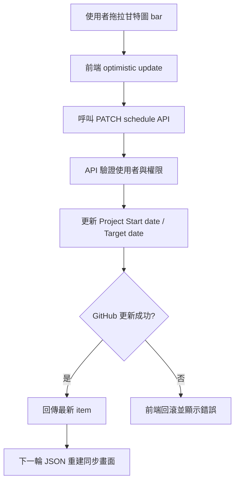

### 3.3 甘特圖更新狀態與負責人

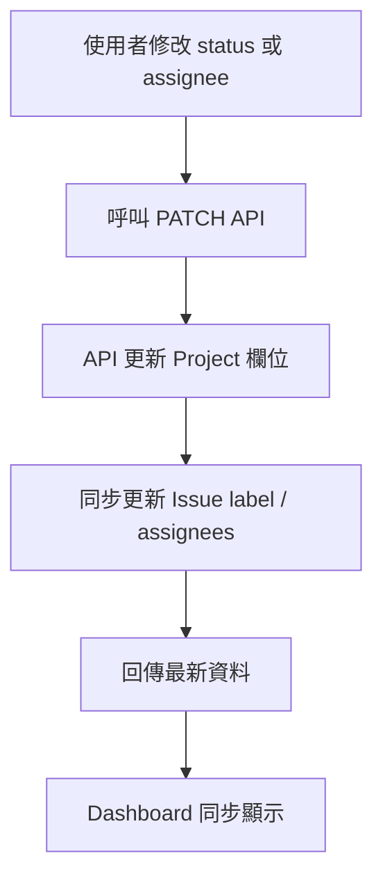

### 3.4 PR 驗收與完成

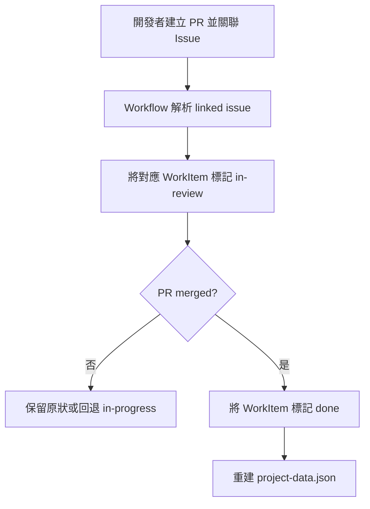

## 4. 虛擬碼

```text
function buildSnapshot(projectItems, issues, pullRequests):
  workItems = []

  for each projectItem in projectItems:
    issue = findLinkedIssue(projectItem, issues)
    prs = findLinkedPullRequests(issue, pullRequests)
    workItem = normalizeWorkItem(projectItem, issue, prs)
    workItems.append(workItem)

  return {
    generatedAt,
    repository,
    projectId,
    milestones: collectMilestones(workItems),
    members: buildMemberLoads(workItems),
    workItems,
    summary: buildSummary(workItems)
  }

function patchSchedule(projectItemId, startDate, targetDate):
  validateDateRange(startDate, targetDate)
  updateProjectField(projectItemId, "Start date", startDate)
  updateProjectField(projectItemId, "Target date", targetDate)
  return fetchProjectItem(projectItemId)

function patchStatus(projectItemId, status):
  updateProjectField(projectItemId, "Status", status)
  syncIssueLabel(projectItemId, status)
  return fetchProjectItem(projectItemId)

function patchAssignees(projectItemId, assigneeLogins):
  updateProjectAssignees(projectItemId, assigneeLogins)
  syncIssueAssignees(projectItemId, assigneeLogins)
  return fetchProjectItem(projectItemId)

function handleIssueOpened(issueNodeId):
  item = addIssueToProject(projectId, issueNodeId)
  startDate = parseIssueSection(issue.body, "預計開始日")
  targetDate = parseIssueSection(issue.body, "預計截止日")
  setDefaultStatus(item.id, "todo")
  if startDate exists:
    updateProjectField(item.id, "Start date", startDate)
  if targetDate exists:
    updateProjectField(item.id, "Target date", targetDate)

function deployPages():
  snapshot = buildSnapshot(projectItems, issues, pullRequests)
  write public/project-data.json
  build vite
  upload pages artifact
  deploy to github pages
```

## 5. 系統脈絡圖

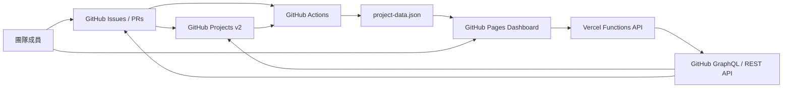

## 6. 容器/部署概觀

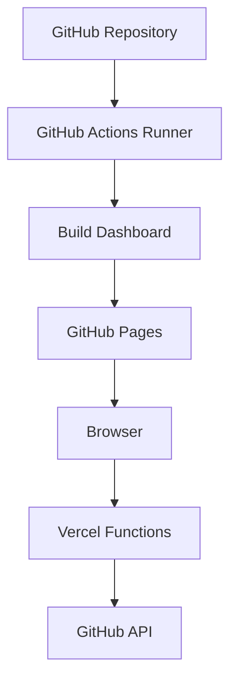

## 7. 模組關係圖

### Frontend

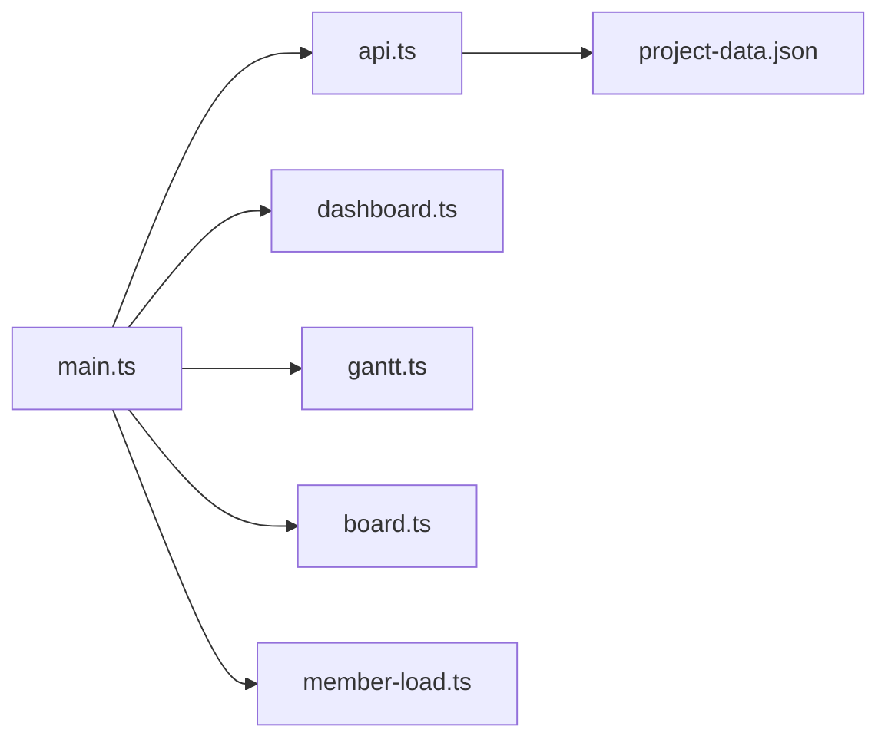

### Automation / API

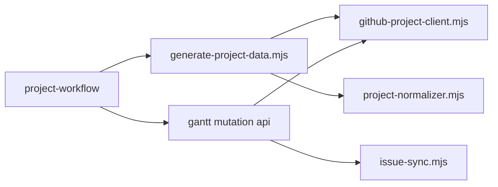

## 8. 序列圖

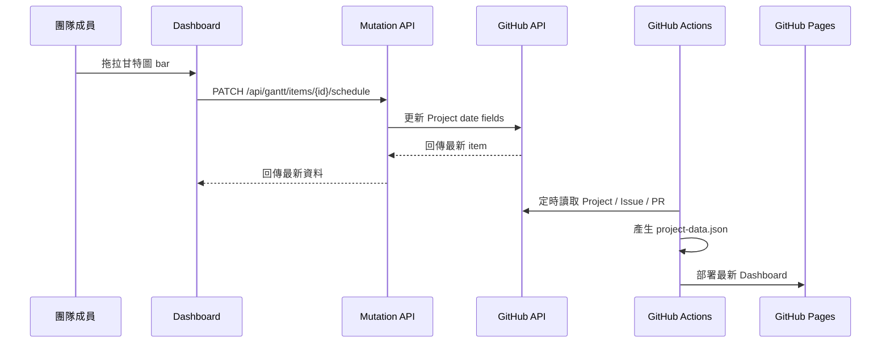

## 9. ER 圖

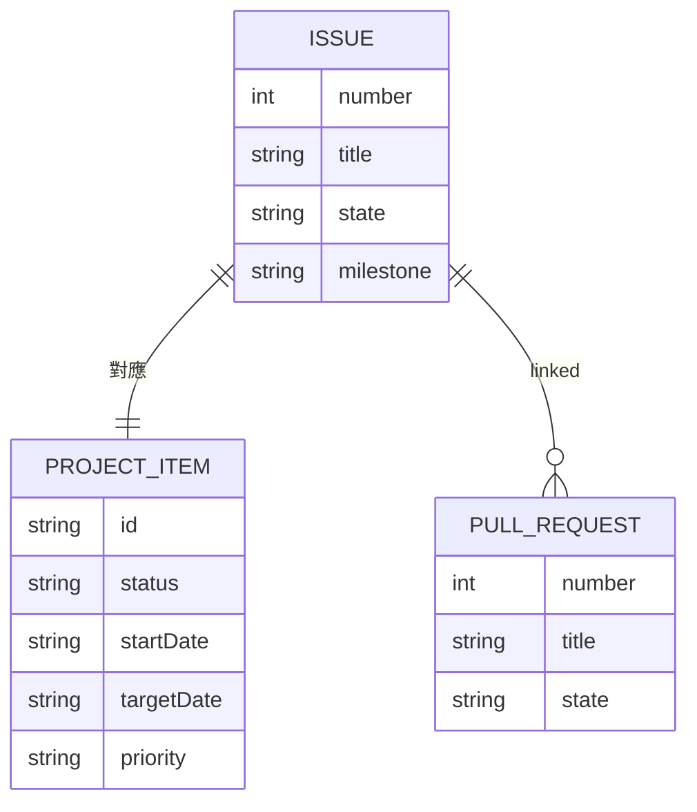

## 10. 類別圖（後端關鍵類別）

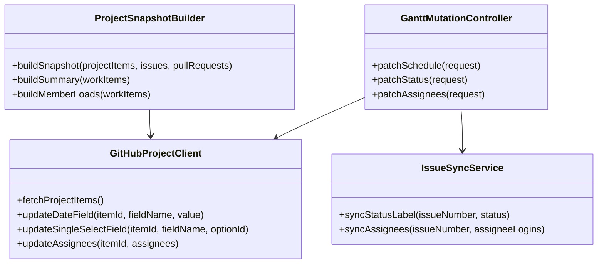

## 11. 流程圖

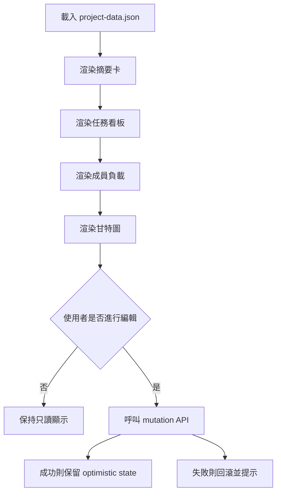

## 12. 狀態圖

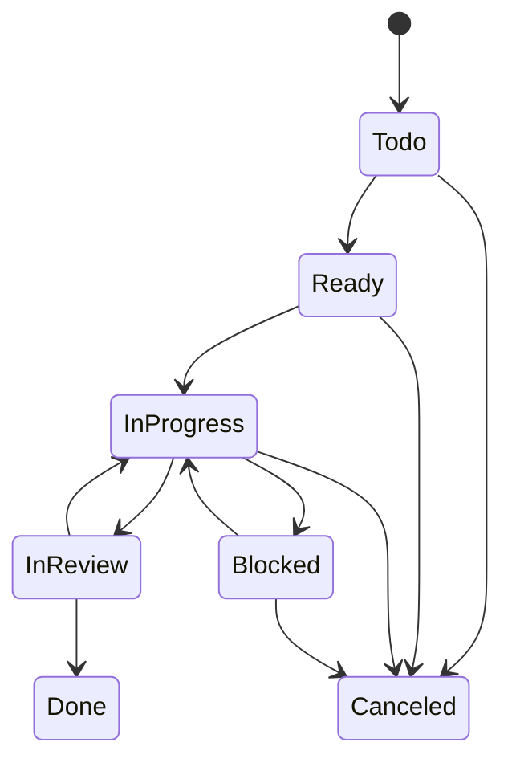

## 驗收標準

- 使用者可透過 Issue Form 建立任務並自動進入 GitHub Project。
- Issue 建立後，workflow 需自動加入指定 GitHub Project 並同步預設欄位。
- Dashboard 需顯示摘要、看板、成員負載與甘特圖。
- 甘特圖需支援拖拉調整開始/截止日。
- 甘特圖需支援更新 `status` 與 `assignees`。
- API 更新失敗時，前端需回滾 optimistic state。
- `project-data.json` 必須統一來自 GitHub Issues、PRs、Projects 資料。
- GitHub Pages workflow 必須使用官方 Pages actions 完成部署。
- PR merge 後，關聯任務需同步轉為 `done`。
- 手機版至少可讀取甘特圖與摘要；桌機版需可完整編輯。
